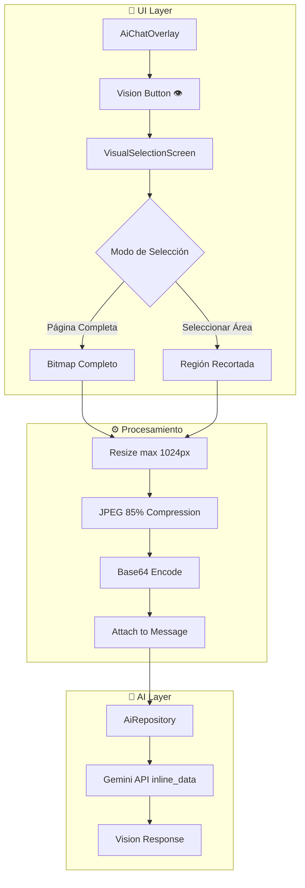
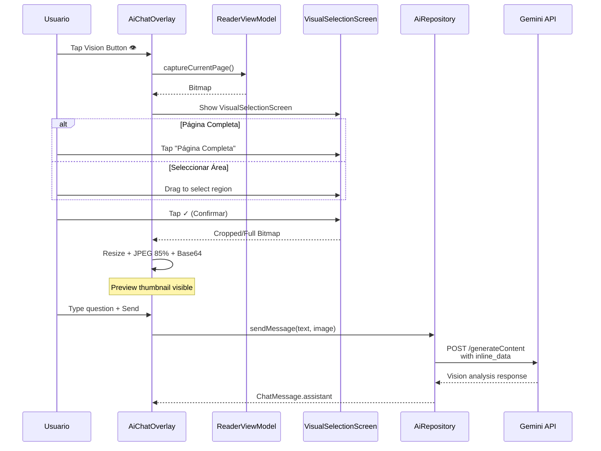

# Visual Selection AI - Documentación de Implementación

## Resumen

Se implementó una funcionalidad de **Visual Understanding** que permite a los usuarios:
1. Capturar la página actual del manga
2. Seleccionar una región específica ("Circle to Search" style)
3. Enviar la imagen al modelo AI multimodal para análisis

---

## Arquitectura



---

## Archivos Modificados

### 1. Domain Layer

#### `ChatMessage.kt`
**Path**: `domain/src/main/java/tachiyomi/domain/ai/model/ChatMessage.kt`

**Cambio**: Agregado campo `image: String? = null` para almacenar imagen Base64.

```kotlin
data class ChatMessage(
    val role: Role,
    val content: String,
    val image: String? = null,  // ← NUEVO: Base64 encoded image
    val timestamp: Long = System.currentTimeMillis(),
) {
    companion object {
        fun user(content: String, image: String? = null) = ChatMessage(Role.USER, content, image = image)
    }
}
```

---

### 2. Data Layer

#### `AiRepositoryImpl.kt`
**Path**: `data/src/main/java/tachiyomi/data/ai/AiRepositoryImpl.kt`

**Cambio**: Soporte multimodal para Gemini API usando `inline_data`.

```kotlin
// Construcción de parts para Gemini
val imageData = msg.image
if (imageData != null) {
    // Image part
    add(GeminiPart(
        inlineData = GeminiInlineData(
            mimeType = "image/jpeg",
            data = imageData,
        ),
    ))
}
// Text part
add(GeminiPart(text = msg.content))
```

**DTOs agregados**:
```kotlin
@Serializable
data class GeminiInlineData(
    @SerialName("mime_type") val mimeType: String,
    val data: String,
)
```

---

### 3. Presentation Layer

#### `VisualSelectionScreen.kt` (NUEVO)
**Path**: `app/src/main/java/eu/kanade/presentation/ai/components/VisualSelectionScreen.kt`

UI inspirada en "Circle to Search" de Google con:

- **Modo "Página Completa"**: Envía toda la página
- **Modo "Seleccionar Área"**: Permite arrastrar para seleccionar región

**Características UI**:
- Overlay oscurecido con área seleccionada transparente
- Esquinas con handles circulares animados
- Botones de confirmar (✓) y cancelar (✕)
- Animaciones con Spring physics

**Técnica clave para transparencia**:
```kotlin
Canvas(
    modifier = Modifier
        .fillMaxSize()
        .graphicsLayer(compositingStrategy = CompositingStrategy.Offscreen),
) {
    // Overlay oscuro
    drawRect(color = Color.Black.copy(alpha = 0.6f))
    // Cortar área seleccionada (transparente)
    drawRect(
        color = Color.Transparent,
        blendMode = BlendMode.Clear,
    )
}
```

---

#### `AiChatOverlay.kt`
**Path**: `app/src/main/java/eu/kanade/presentation/ai/components/AiChatOverlay.kt`

**Cambios**:

1. **Botón Vision** (icono ojo) junto al campo de texto
2. **Preview de imagen** encima del input cuando hay imagen adjunta
3. **Parámetros nuevos**:
   - `onCaptureVision: () -> Unit`
   - `hasAttachedImage: Boolean`
   - `attachedImageBase64: String?`
   - `onClearAttachedImage: () -> Unit`

**Preview de imagen**:
```kotlin
// Image preview strip (when image is attached)
AnimatedVisibility(visible = attachedImageBase64 != null) {
    Row {
        Image(
            bitmap = decodedBitmap,
            modifier = Modifier.size(64.dp).clip(RoundedCornerShape(8.dp)),
        )
        // Close button
        Surface(onClick = onClearAttachedImage, shape = CircleShape) {
            Icon(Icons.Default.Close)
        }
        Text("Imagen adjunta")
    }
}
```

**Fix de duplicate key crash**:
```kotlin
// Antes (crasheaba con timestamps duplicados)
items(items = messages, key = { it.timestamp })

// Después (key única con index)
itemsIndexed(
    items = filteredMessages,
    key = { index, message -> "${index}_${message.timestamp}" },
)
```

---

#### `AiChatScreen.kt`
**Path**: `app/src/main/java/eu/kanade/presentation/ai/AiChatScreen.kt`

**Cambio**: Mismo fix de duplicate key para el chat principal.

---

### 4. ViewModel Layer

#### `ReaderViewModel.kt`
**Path**: `app/src/main/java/eu/kanade/tachiyomi/ui/reader/ReaderViewModel.kt`

**Función nueva**: `captureCurrentPage(): Bitmap?`

```kotlin
suspend fun captureCurrentPage(): android.graphics.Bitmap? {
    val page = getCurrentChapter()?.pages?.getOrNull(chapterPageIndex)
    if (page?.status != Page.State.Ready) return null
    
    return withIOContext {
        val stream = page.stream?.invoke() ?: return@withIOContext null
        val originalBitmap = BitmapFactory.decodeStream(stream)
        
        // Resize for efficiency (max 1024px)
        val maxDim = 1024
        if (originalBitmap.width > maxDim || originalBitmap.height > maxDim) {
            val ratio = min(maxDim.toDouble() / originalBitmap.width,
                           maxDim.toDouble() / originalBitmap.height)
            Bitmap.createScaledBitmap(originalBitmap, 
                (originalBitmap.width * ratio).toInt(),
                (originalBitmap.height * ratio).toInt(), true)
        } else originalBitmap
    }
}
```

---

#### `ReaderActivity.kt`
**Path**: `app/src/main/java/eu/kanade/tachiyomi/ui/reader/ReaderActivity.kt`

**Integración del flujo completo**:

1. **Estado**:
```kotlin
var attachedImage: String? by remember { mutableStateOf(null) }
var showVisualSelection by remember { mutableStateOf(false) }
var capturedBitmap: Bitmap? by remember { mutableStateOf(null) }
```

2. **VisualSelectionScreen**:
```kotlin
if (showVisualSelection && capturedBitmap != null) {
    VisualSelectionScreen(
        bitmap = capturedBitmap!!,
        onConfirm = { selectedBitmap ->
            // Convert to Base64
            val stream = ByteArrayOutputStream()
            selectedBitmap.compress(Bitmap.CompressFormat.JPEG, 85, stream)
            attachedImage = Base64.encodeToString(stream.toByteArray(), Base64.NO_WRAP)
            showVisualSelection = false
        },
        onCancel = { showVisualSelection = false },
    )
}
```

3. **System Prompt con idioma**:
```kotlin
// PRIMERA LÍNEA del system prompt
appendLine("CRITICAL: You MUST respond in the SAME LANGUAGE as the user's message. Si el usuario escribe en español, responde en español.")
```

---

## Flujo de Datos



---

## Optimizaciones

| Aspecto | Implementación | Beneficio |
|---------|---------------|-----------|
| **In-Memory** | Nunca guarda imagen en disco | Privacidad |
| **Resize** | Max 1024px antes de encode | -70% tamaño |
| **Compresión** | JPEG 85% | Balance calidad/tamaño |
| **Lazy Decode** | `remember(base64)` para bitmap | Evita re-decode |
| **Spring Animations** | UI fluida | UX premium |

---

## Idioma del AI

La instrucción de idioma está al **inicio** del system prompt para máxima prioridad:

```kotlin
appendLine("CRITICAL: You MUST respond in the SAME LANGUAGE as the user's message. Si el usuario escribe en español, responde en español. If the user writes in English, respond in English.")
```

---

## Bugs Corregidos

### 1. Selector de área negro
**Problema**: `BlendMode.Clear` no funcionaba sin compositing layer.
**Solución**: `graphicsLayer(compositingStrategy = CompositingStrategy.Offscreen)`

### 2. Crash por duplicate key
**Problema**: Mensajes con mismo timestamp causaban crash en LazyColumn.
**Solución**: Key compuesta `"${index}_${message.timestamp}"`

### 3. AI respondía en inglés
**Problema**: La instrucción de idioma estaba muy abajo en el prompt.
**Solución**: Mover al inicio con "CRITICAL" y texto bilingüe.

---

## Archivos Totales Modificados

| Archivo | Tipo | LOC |
|---------|------|-----|
| `VisualSelectionScreen.kt` | NEW | ~350 |
| `ChatMessage.kt` | MODIFY | +3 |
| `AiRepositoryImpl.kt` | MODIFY | +20 |
| `ReaderViewModel.kt` | MODIFY | +40 |
| `AiChatOverlay.kt` | MODIFY | +100 |
| `AiChatScreen.kt` | MODIFY | +5 |
| `ReaderActivity.kt` | MODIFY | +60 |
| `NovelViewer.kt` | MODIFY | +5 |
| `AiChatScreenModel.kt` | MODIFY | +60 |
| **Total** | | **~640** |

---

## Testing Manual

1. ✅ Abrir manga → AI chat overlay → Botón Vision
2. ✅ VisualSelectionScreen aparece con página actual
3. ✅ Modo "Página Completa" captura todo
4. ✅ Modo "Seleccionar Área" permite arrastrar (transparente)
5. ✅ Preview de imagen visible antes de enviar
6. ✅ Enviar mensaje con imagen → AI describe la imagen
7. ✅ AI responde en español si preguntas en español
8. ✅ Cancelar limpia la selección
9. ✅ Abrir historial de chat no crashea
